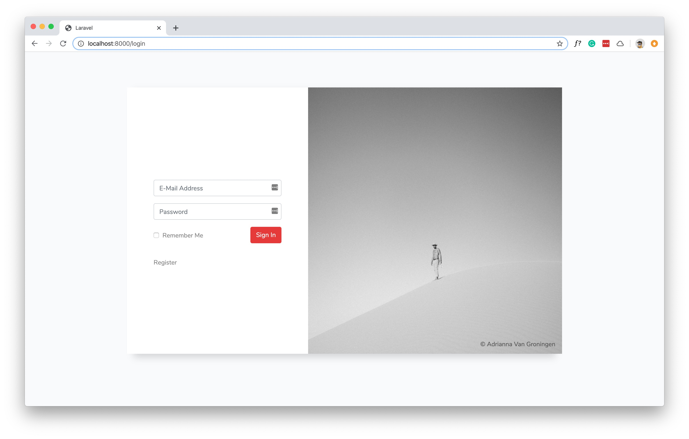
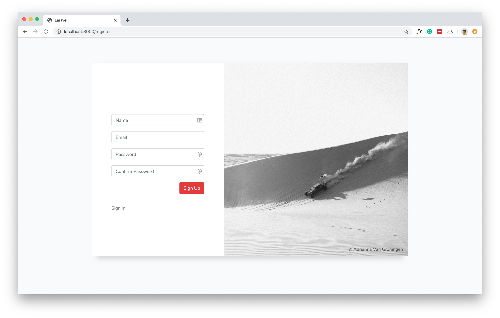

# Custom Auth View and Layout

Here is a custom `views/layout/app.blade.php`, `views/auth/login.blade.php` and `views/auth/register.blade.php` to give the default login and registration view some facelift.

### How To Install
After your scaffold your auth views - replace the default `views/layout/app.blade.php`, `views/auth/login.blade.php` and `views/auth/register.blade.php`  with these files **in this repository**.

Also add `public\images` and `public\css\login.css` from **this repository** to your `public` folder. That's all!

> Tested with Laravel 6x and 7x.

## Screenshot (Login)

## Screenshot (Registration)

### Image Copyright (From UnSplash)
* `Adriana.jpg` - [© Adrianna Van Groningen ](https://unsplash.com/photos/5a6rrTJ6XTM)
* `Adriana2.jpg` - [© Adrianna Van Groningen ](https://unsplash.com/photos/ohdvmatHHvo)

### License
This work (blade files and css files) is distributed under the [MIT License](https://opensource.org/licenses/MIT). Photos are by [Adrianna Van Groningen](https://unsplash.com/@arosephotos) and of free to use. 